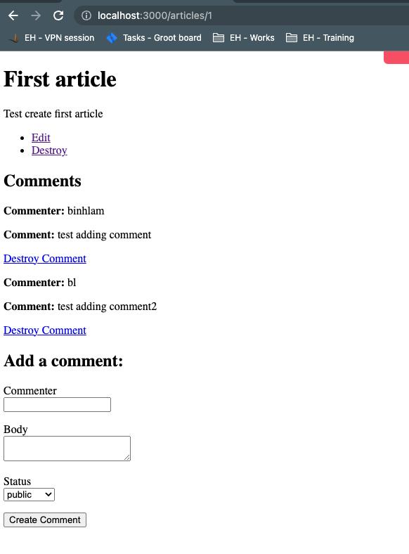

# README

This repository aims to work on a practical rails web application which
mimics a blog where user can perform CRUD on articles and comments with
a simple authentication provided.

Knowledge covered:

* Ruby version

* System dependencies

* Configuration

* Database creation

* Database migration

* Request routing

